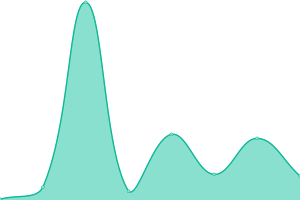
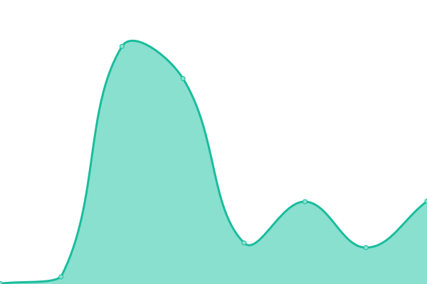
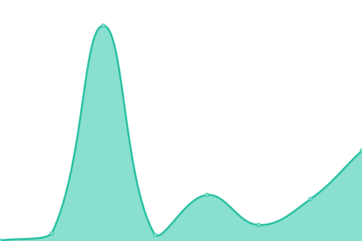
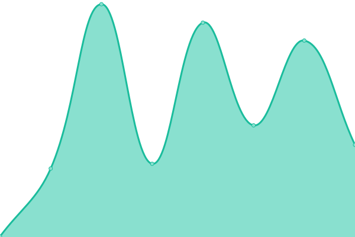

# [📈 Live Status](https://precisiongenetics.github.io/status-page): <!--live status--> **🟩 All systems operational**

This repository contains the open-source uptime monitor and status page for [precisiongenetics](https://precisiongenetics.github.io/status-page), powered by [Upptime](https://github.com/upptime/upptime).

With [Upptime](https://upptime.js.org), you can get your own unlimited and free uptime monitor and status page, powered entirely by a GitHub repository. We use [Issues](https://github.com/precisiongenetics/status-page/issues) as incident reports, [Actions](https://github.com/precisiongenetics/status-page/actions) as uptime monitors, and [Pages](https://precisiongenetics.github.io/status-page) for the status page.

<!--start: status pages-->
<!-- This summary is generated by Upptime (https://github.com/upptime/upptime) -->
<!-- Do not edit this manually, your changes will be overwritten -->
<!-- prettier-ignore -->
| URL | Status | History | Response Time | Uptime |
| --- | ------ | ------- | ------------- | ------ |
|  [Precision Genetics](https://www.precisiongenetics.com) | 🟩 Up | [precision-genetics.yml](https://github.com/precisiongenetics/status-page/commits/HEAD/history/precision-genetics.yml) | 

 324ms
     
 | 

<a href="https://status.precisiongenetics.com/history/precision-genetics">100.00%</a>
    

|  [Kahuna API](https://api.precisiongenetics.com/kahuna/v1/status) | 🟩 Up | [kahuna-api.yml](https://github.com/precisiongenetics/status-page/commits/HEAD/history/kahuna-api.yml) | 

 183ms
     
 | 

<a href="https://status.precisiongenetics.com/history/kahuna-api">100.00%</a>
    

|  [Health API](https://api.precisiongenetics.com/health/v1/status) | 🟩 Up | [health-api.yml](https://github.com/precisiongenetics/status-page/commits/HEAD/history/health-api.yml) | 

 60ms
     
 | 

<a href="https://status.precisiongenetics.com/history/health-api">99.61%</a>
    

|  [Communications API](https://api.precisiongenetics.com/email/v1/status) | 🟩 Up | [communications-api.yml](https://github.com/precisiongenetics/status-page/commits/HEAD/history/communications-api.yml) | 

 61ms
     
 | 

<a href="https://status.precisiongenetics.com/history/communications-api">100.00%</a>
    

|  [Jobs API](https://api.precisiongenetics.com/jobs/v1/status) | 🟩 Up | [jobs-api.yml](https://github.com/precisiongenetics/status-page/commits/HEAD/history/jobs-api.yml) | 

 75ms
     
 | 

<a href="https://status.precisiongenetics.com/history/jobs-api">100.00%</a>
    

|  [Beat API](https://api.precisiongenetics.com/beat/v1/status) | 🟩 Up | [beat-api.yml](https://github.com/precisiongenetics/status-page/commits/HEAD/history/beat-api.yml) | 

 68ms
     
 | 

<a href="https://status.precisiongenetics.com/history/beat-api">100.00%</a>
    

|  [Reports API](https://api.precisiongenetics.com/reports/v1/status) | 🟩 Up | [reports-api.yml](https://github.com/precisiongenetics/status-page/commits/HEAD/history/reports-api.yml) | 

 69ms
     
 | 

<a href="https://status.precisiongenetics.com/history/reports-api">100.00%</a>
    

|  [Frontend UI](https://qrm.precisiongenetics.com/auth/login) | 🟩 Up | [frontend-ui.yml](https://github.com/precisiongenetics/status-page/commits/HEAD/history/frontend-ui.yml) | 

 119ms
     
 | 

<a href="https://status.precisiongenetics.com/history/frontend-ui">100.00%</a>
    

<!--end: status pages-->

[**Visit our status website →**](https://precisiongenetics.github.io/status-page)

## 📄 License

- Powered by: [Upptime](https://github.com/upptime/upptime)
- Code: [MIT](./LICENSE) © [precisiongenetics](https://precisiongenetics.github.io/status-page)
- Data in the `./history` directory: [Open Database License](https://opendatacommons.org/licenses/odbl/1-0/)
